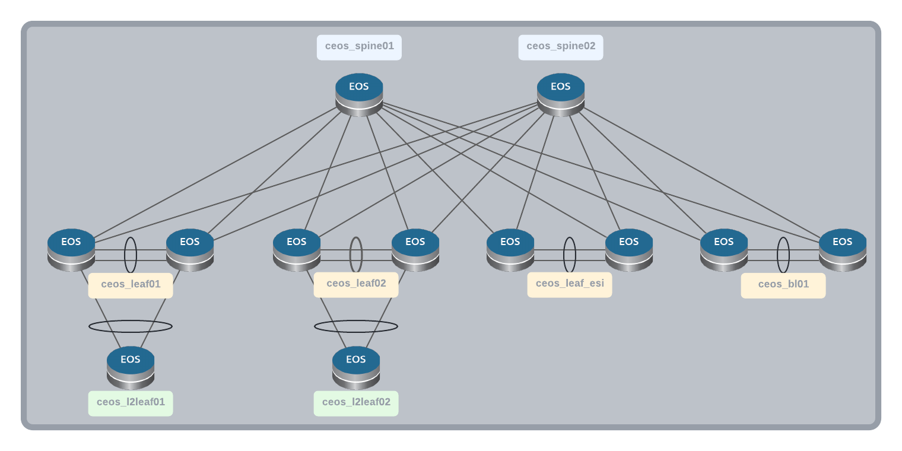

# avd-to-containerlab demo

Content of this repo is to serve example used in this [blog post](https://www.inetsix.net/posts/avd-with-containerlab/)

## Resources

- [Containerlab](https://containerlab.srlinux.dev) / [User Guide](https://containerlab.srlinux.dev/manual/topo-def-file/)
- Containerlab [examples](https://containerlab.srlinux.dev/lab-examples/lab-examples/)
- Arista [EOS AVD Topology examples](https://github.com/arista-netdevops-community/avd-quickstart-containerlab)
- Arista AVD ansible Collection: [Documentation](https://www.avd.sh/) / [Repository](https://github.com/aristanetworks/ansible-avd/)
- Collection to [map AVD with Containerlab](https://github.com/titom73/ansible-inetsix/tree/master/ansible_collections/titom73/avd_tools/roles/eos_designs_to_containerlab)
- [User journey & experiences](https://juliopdx.com/2021/12/10/my-journey-and-experience-with-containerlab/) with Containerlab by [@Julio](https://twitter.com/Julio_PDX)
